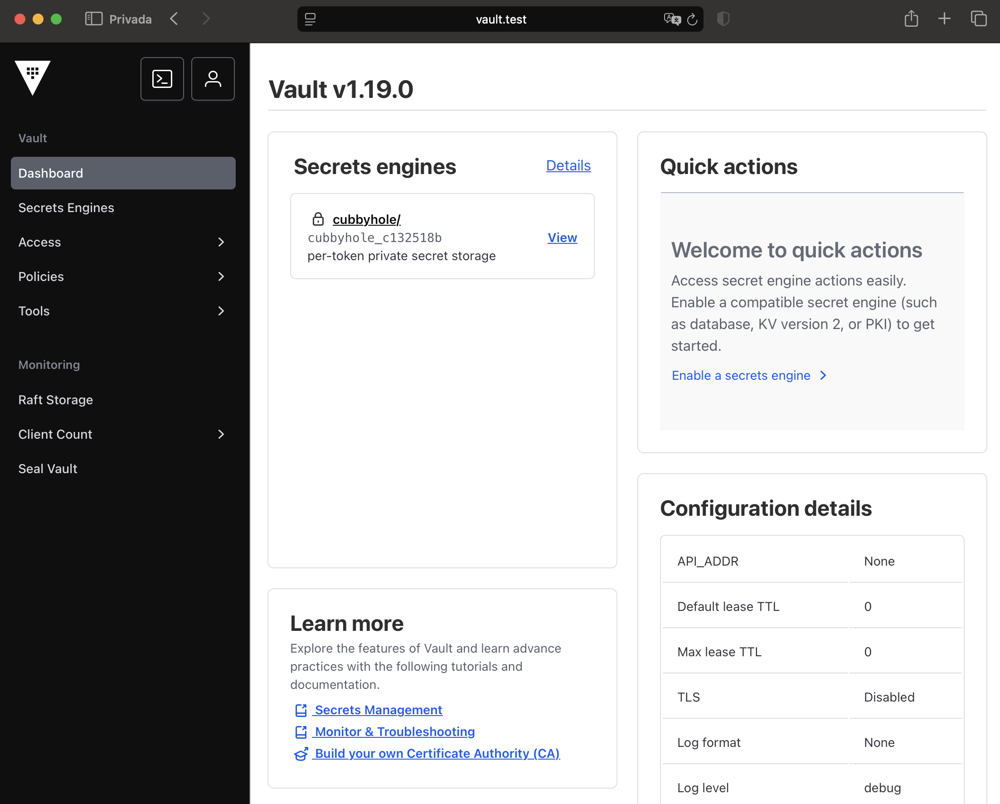
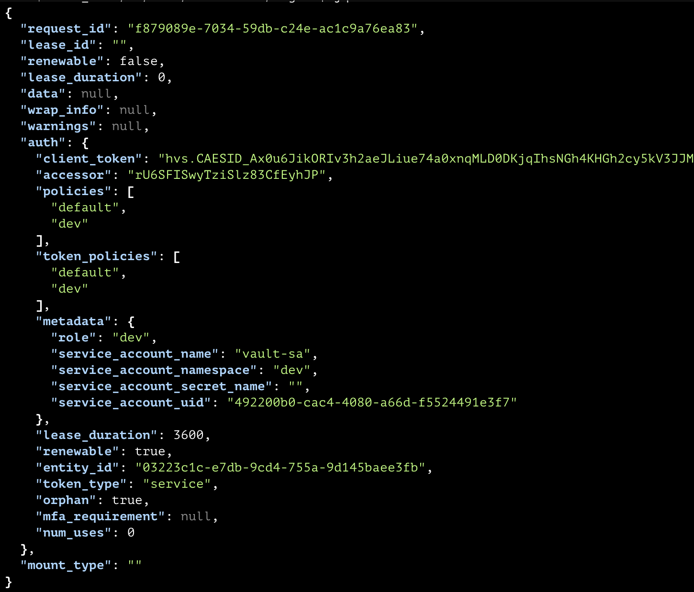
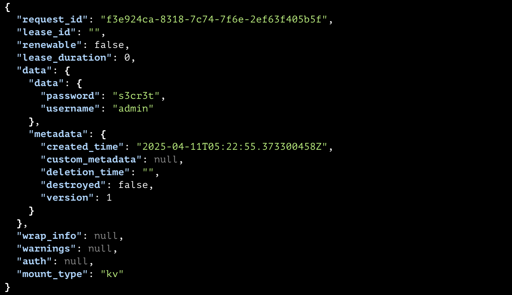
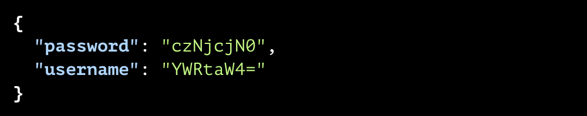
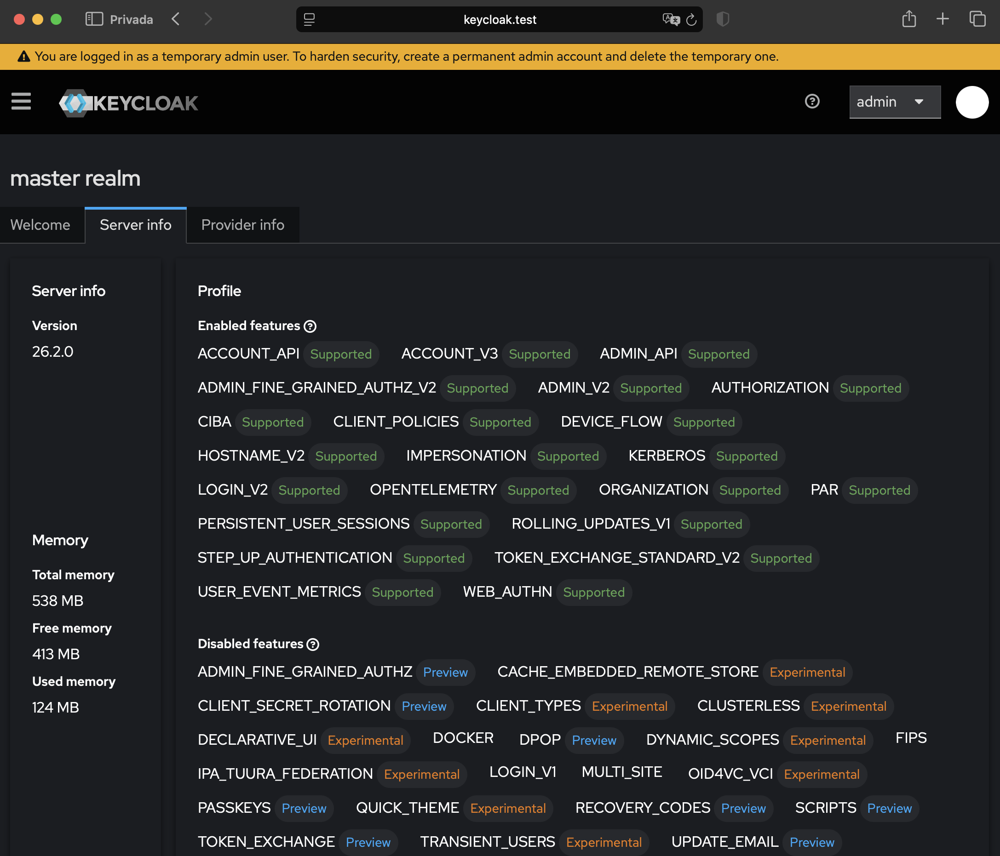

== Platform Foundation: K3d, Vault, ESO, and Keycloak Setup

The following components form the technical foundation for deploying secure, multi-environment secret management and authentication platforms within Kubernetes.  
This section provides a structured setup to ensure isolation, scalability, and reproducibility across the environments `dev`, `qa`, and `prod`.

=== Provisioning the K3s Cluster

K3s is a lightweight Kubernetes distribution optimized for resource-constrained environments and rapid prototyping. k3d further simplifies deployment by running K3s clusters inside Docker containers, enabling easy resets, snapshots, and multi-node simulations without VM overhead.

==== Step 1: Install K3d

[NOTE]
====
- For installation instructions, refer to the official k3d documentation: https://k3d.io/stable/#installation[k3d, window="_blank"].
- To install `kubectl`, follow the official Kubernetes documentation: https://kubernetes.io/docs/tasks/tools/[kubectl, window="_blank"].
- The Kubernetes version used in this seminar is `v1.31.5+k3s1`.
====

Verify the installation:

[source,bash]
----
k3d version
----

Expected output should look similar to:

[source,console]
----
k3d version v5.8.3
k3s version v1.31.5-k3s1 (default)
----

==== Step 2: Create the K3s Cluster

We'll create a cluster with one server node and two agent nodes, exposing ports 443 and 80 for the load balancer.

[source,bash]
----
k3d cluster create workshop \
  --servers 1 \
  --agents 2 \
  --port "443:443@loadbalancer" \
  --port "80:80@loadbalancer"
----

This command:

- Creates a cluster named `workshop`.
- Starts 1 server (control-plane) and 2 agents (workers).
- Exposes port 443 from the load balancer to the host.
- Disables Traefik to avoid conflicts with custom ingress controllers.

==== Step 3: Verify Cluster Status

[source,bash]
----
kubectl get nodes
----

Expected output:

[source,console]
----
NAME                    STATUS   ROLES                  AGE   VERSION
k3d-workshop-agent-0    Ready    <none>                 11s   v1.31.5+k3s1
k3d-workshop-agent-1    Ready    <none>                 11s   v1.31.5+k3s1
k3d-workshop-server-0   Ready    control-plane,master   18s   v1.31.5+k3s1
----

The K3s cluster is now ready for deploying Vault and other components.

[NOTE]
====
To temporarily stop the cluster and free up system resources, you can stop the underlying Docker containers:

[source,bash]
----
k3d cluster stop workshop
----

To bring the cluster back online later:

[source,bash]
----
k3d cluster start workshop
----

This is especially useful during multi-day workshops or when switching between tasks, as it avoids recreating the cluster from scratch.
====

=== Installing Vault

In this step, we will install HashiCorp Vault in the Kubernetes cluster using Helm. Vault will serve as our central secret management system. We will use the official Helm chart and run it in "dev" mode initially, just to validate the deployment and make quick iterations.

.Recommended Resources:
[TIP]
====
- https://developer.hashicorp.com/vault/docs/what-is-vault[What is Vault?, window="_blank"]
- https://developer.hashicorp.com/vault/docs/platform/k8s/helm[Vault Helm chart, window="_blank"]
- https://helm.sh/docs/intro/install/[Helm Installation, window="_blank"]
====

==== Add the HashiCorp Helm Repository

[source,bash]
----
helm repo add hashicorp https://helm.releases.hashicorp.com
helm repo update
----

==== Deploying Vault in HA Mode

In this section, we will deploy Vault in High Availability (HA) mode using the integrated Raft storage backend. This setup provides a more realistic and production-like experience, suitable for multi-node clusters and secret replication scenarios.

We start by installing Vault using the official Helm chart, with a custom `values.yaml` file that enables HA mode and configures Raft storage with `retry_join` directives.

[source,bash]
----
helm upgrade --install vault hashicorp/vault \
  --namespace vault \
  --create-namespace \
  -f helm/vault/config.yaml
----

The configuration:

- Deploys 3 Vault replicas.

- Enables Raft storage with automatic `retry_join`.

- In this seminar, TLS is disabled for Vault for simplicity and local accessibility.  **In production environments, always enable TLS** to protect secret communications.

- Exposes the Vault UI using a LoadBalancer service.

==== Wait for the Pods to Be Ready

Check that all Vault pods are running:

[source,bash]
----
kubectl get pods -n vault
----

Expected output:

[source,console]
----
NAME      READY   STATUS    RESTARTS   AGE
vault-0   1/1     Running   0          2m
vault-1   1/1     Running   0          2m
vault-2   1/1     Running   0          2m
----

==== Initialize the Vault Cluster

Vault must be initialized before it can be used. This step generates the master key, which is split into multiple unseal keys.

We'll use a simplified setup with only **1 unseal key** required:

[source,bash]
----
kubectl exec -it vault-0 -n vault -- vault operator init -key-shares=1 -key-threshold=1
----

[NOTE]
====
Vault uses Shamir’s Secret Sharing algorithm to split a master key into multiple parts (shares).  
- `key-shares` is the total number of unseal keys generated.  
- `key-threshold` is the number of keys required to unseal the Vault.

For this seminar, we simplify by using 1 key out of 1 (`1-of-1`), which is **not secure for production**, but ideal for learning purposes.
====

Make sure to **copy and store the unseal key and root token** that are printed. You’ll need them in the next step.

==== Unseal All Vault Nodes

Each Vault pod must be manually unsealed (unless auto-unseal is configured).  
You will use the same unseal key generated during the initialization step.

To simplify this process, we recommend storing the unseal key in a shell variable:

[source,bash]
----
export VAULT_UNSEAL_KEY="your-unseal-key-here"
----

Replace `"your-unseal-key-here"` with the key printed during `vault operator init`.

Then unseal each pod using:

[source,bash]
----
kubectl exec -it vault-0 -n vault -- vault operator unseal $VAULT_UNSEAL_KEY
kubectl exec -it vault-1 -n vault -- vault operator unseal $VAULT_UNSEAL_KEY
kubectl exec -it vault-2 -n vault -- vault operator unseal $VAULT_UNSEAL_KEY
----

After all nodes are unsealed, you can verify the cluster status by running:

[source,bash]
----
kubectl exec -it vault-0 -n vault -- vault status
----

This will show whether Vault is sealed, the current HA mode, the active node, and peer connectivity.

==== Accessing the Vault UI via Ingress

To access the Vault Web UI using an Ingress controller (e.g. Traefik), we expose the Vault service externally by deploying a custom Ingress using our own Helm chart.

. Make sure an Ingress controller like Traefik is deployed in your cluster.

. Deploy the Ingress pointing to the `vault-ui` service using the following Helm command:

[source,bash]
----
helm upgrade --install vault-ui-ingress ./helm/traefik/ingress \
  --namespace vault \
  --set name=vault-ui-ingress \
  --set namespace=vault \
  --set annotations.ingressClass=traefik \
  --set spec.ingressClassName=traefik \
  --set spec.rules.host=vault.test \
  --set spec.rules.paths[0].path="/" \
  --set spec.rules.paths[0].pathType=Prefix \
  --set spec.rules.paths[0].backend.service.name=vault-ui \
  --set spec.rules.paths[0].backend.service.port=8200 \
  --set tls.enabled=false
----

This configuration:

- Deploys a Kubernetes `Ingress` resource under the `vault` namespace
- Points to the `vault-ui` service on port `8200`
- Uses Traefik as the Ingress controller
- Does **not** enable TLS (exposes via HTTP only)

. Add a DNS entry in your local `/etc/hosts` file to route `vault.test` to your local Ingress controller (typically `127.0.0.1`):

[source,bash]
----
echo "127.0.0.1 vault.test" | sudo tee -a /etc/hosts
----

. Open your browser and go to: http://vault.test[http://vault.test, window="_blank"]

. Log in using the **Initial Root Token**.

Vault is now accessible through an Ingress route, ready to be used with the rest of your platform.

You can also access the Vault UI via port-forwarding:
[source,bash]
----
kubectl port-forward -n vault svc/vault-ui 8200:8200
----

Then visit: http://localhost:8200
Login using the **Initial Root Token**.

After logging in, you should see the Vault UI dashboard

.Vault dashboard 

=== Preparing Kubernetes Namespaces and Workloads

Before configuring Vault, we need to prepare our Kubernetes cluster with the necessary namespaces.

Each environment (`dev`, `qa`, `prod`) will have:

- A dedicated Kubernetes namespace
- A custom ServiceAccount named `vault-sa`

This setup ensures that:

- Vault roles and policies can bind securely to service accounts per namespace
- Secrets can later be synced with External Secrets Operator (ESO) in a clean, isolated manner

==== Create Namespaces and Service Accounts

[source,bash]
----
for ns in dev qa prod; do
  kubectl create namespace $ns
  kubectl create serviceaccount vault-sa -n $ns
done
----

[NOTE]
====
We intentionally avoid using the default service account to improve security and clarity in Vault bindings.
====

Once these namespaces and service accounts are in place, we can proceed to configure Vault using Terraform.

=== Configuring Vault

With Vault running in High Availability (HA) mode, we now configure it to manage secrets for three isolated environments: `dev`, `qa`, and `prod`.

Since Vault OSS does not support namespaces (an Enterprise-only feature), we simulate environment-level isolation using a combination of:

- Separate KV secrets engines: `secret-dev`, `secret-qa`, and `secret-prod`
- Access control policies (ACLs) scoped to each environment
- Kubernetes auth roles bound to specific namespaces

All configuration is automated using Terraform for consistency, reproducibility, and version control.

==== Directory Structure

All Terraform files related to Vault configuration are located under `terraform/vault/`:

[source,console]
----
terraform/vault/
├── kubernetes_auth.tf   # Enables Kubernetes auth and defines Vault roles
├── kv_mounts.tf         # Mounts KV v2 engines for dev, qa, and prod
├── policies.tf          # Defines ACL policies for each environment
├── provider.tf          # Vault provider configuration using input variables
└── variables.tf         # Input variables for Vault address and token
----

==== Mounting KV Engines

The `kv_mounts.tf` file mounts a KV v2 secrets engine for each environment using `vault_mount` resources.

These mounts appear as:

- `secret-dev/` → used exclusively by workloads in the `dev` namespace
- `secret-qa/`  → used by `qa` workloads
- `secret-prod/` → dedicated to `prod`

All engines are configured with version 2 for secret versioning and soft delete support.

==== Defining Access Policies

The file `policies.tf` defines a Vault policy for each environment.  
Each policy allows read-only access to the corresponding KV mount, ensuring strict separation of access.

Example: `dev` policy

[source,hcl]
----
path "secret-dev/data/*" {
  capabilities = ["read", "list"]
}
----

This approach prevents workloads in one namespace from accessing secrets belonging to another.

==== Enabling Kubernetes Authentication

The `kubernetes_auth.tf` file automates the full setup of the Kubernetes auth method in Vault:

- Enables the `kubernetes` auth backend
- Configures Vault to communicate with the in-cluster Kubernetes API
- Creates one Vault `role` per environment:
  - `dev` role → bound to service accounts in the `dev` namespace
  - `qa` role → bound to `qa` namespace
  - `prod` role → bound to `prod` namespace

This ensures that only authorized workloads can request secrets from the correct environment.

==== Providing Vault and Kubernetes Credentials

To securely configure Vault with Kubernetes authentication, we supply Terraform with the necessary sensitive variables via a `.auto.tfvars.json` file. This format ensures that variables are automatically discovered during `terraform apply`, avoiding the need for manual input via CLI arguments or environment variables. It also promotes reproducibility and reduces the likelihood of human error in automation pipelines. Additionally, the `.json` format is ideal for handling complex or multiline values such as certificates and JWT tokens.

Create the file `secrets.auto.tfvars.json` inside `terraform/vault/` with the following content:

[source,json]
----
{
  "vault_addr": "http://vault.test",
  "vault_token": "hvs.YourRootTokenHere",
  "kubernetes_host": "https://kubernetes.default.svc",
  "kubernetes_ca_cert": "-----BEGIN CERTIFICATE-----\nMIID...\n-----END CERTIFICATE-----",
  "token_reviewer_jwt": "eyJhbGciOiJSUzI1NiIsIn..."
}
----

[NOTE]
====
Terraform automatically loads all files ending in `.auto.tfvars.json`, so there's no need to specify this file manually during `terraform apply`.
====

==== How to Obtain the Required Values

Vault's Kubernetes authentication method relies on validating ServiceAccount JWT tokens presented by pods in the cluster. To establish trust, Vault must be configured with:

- The Kubernetes cluster’s public CA certificate (used to verify the API server's TLS identity).
- A valid ServiceAccount JWT token (used to authenticate incoming pod identities).

These credentials are typically retrieved from within a pod that has access to the Kubernetes API. By capturing them directly from a running pod, we ensure compatibility with the in-cluster configuration and secure communication with the Kubernetes control plane.

These values can be extracted from any running pod in your cluster, such as `vault-0`.

To get the Kubernetes CA certificate:

[source,bash]
----
kubectl exec -n vault vault-0 -- cat /var/run/secrets/kubernetes.io/serviceaccount/ca.crt | awk '{printf "%s\\n", $0}'
----

Copy the entire output, including the `-----BEGIN CERTIFICATE-----` and `-----END CERTIFICATE-----` lines into the JSON value of `kubernetes_ca_cert`.

To get the token reviewer JWT:

[source,bash]
----
kubectl exec -n vault vault-0 -- cat /var/run/secrets/kubernetes.io/serviceaccount/token
----

Copy the full JWT token output and paste it into the `token_reviewer_jwt` field.

[IMPORTANT]
====
Do not commit the `secrets.auto.tfvars.json` file to version control.  
Add it to `.gitignore` to protect your credentials.
====

==== Applying the Configuration

Once the variables file is ready, apply the configuration:

[source,bash]
----
cd terraform/vault
terraform init
terraform apply
----

Terraform will:

- Mount the three KV secrets engines
- Upload environment-specific access policies
- Enable and configure the Kubernetes authentication backend
- Create Vault roles bound to service accounts in the `dev`, `qa`, and `prod` namespaces

Your Vault instance is now fully configured for secure, isolated access from each Kubernetes environment.

==== Verifying Kubernetes Authentication to Vault

Now that Vault is configured, we can verify that a Kubernetes workload in the `dev` namespace can authenticate to Vault and access its secrets securely using the `vault-sa` service account.

===== Step 1: Create a test secret in Vault

First, store a secret in the `secret-dev` path using a Vault token that has the appropriate policy (e.g., the root token):

[NOTE]
====
If you don’t have the Vault CLI installed, download it from: https://developer.hashicorp.com/vault/install[Vault Downloads, window="_blank"]  
After extracting the binary, ensure it’s in your system `PATH`.
====

[source,bash]
----
export VAULT_ADDR=http://vault.test
export VAULT_TOKEN=hvs.YourRootTokenHere

vault kv put secret-dev/example username="admin" password="s3cr3t"
vault kv put secret-qa/example username="admin" password="s3cr3t"
----

[WARNING]
====
If you see the error:

`permission denied`

Make sure you're using a Vault token that includes the correct policy (`dev`, `qa`, or `prod`) for the secrets engine you're targeting.
====

===== Step 2: Deploy a test pod using `vault-sa`

Run the following command to deploy a temporary test pod in the `dev` namespace:

[source,bash]
----
kubectl apply -f - <<EOF
apiVersion: v1
kind: Pod
metadata:
  name: test-vault
  namespace: dev
spec:
  serviceAccountName: vault-sa
  containers:
  - name: tester
    image: alpine
    command: ["sh", "-c", "sleep 3600"]
  restartPolicy: Never
EOF
----

===== Step 3: Access the pod and install curl + jq

[source,bash]
----
kubectl exec -it test-vault -n dev -- sh
----

Once inside the pod, install the required tools:

[source,sh]
----
apk add --no-cache curl jq
----

===== Step 4: Authenticate with Vault using the pod’s service account

Export the Vault address and read the pod’s JWT token:

[source,sh]
----
export VAULT_ADDR=http://vault.vault.svc:8200
export SA_TOKEN=$(cat /var/run/secrets/kubernetes.io/serviceaccount/token)
----

Use the token to authenticate to Vault:

[source,sh]
----
export VAULT_TOKEN=$(curl --silent --request POST \
  --data '{"jwt": "'"$SA_TOKEN"'", "role": "dev"}' \
  $VAULT_ADDR/v1/auth/kubernetes/login | jq -r '.auth.client_token')

# Verify the token
echo $VAULT_TOKEN
----

The response that you receive should look similar to this:

.Vault token issued via Kubernetes authentication using vault-sa in dev namespace

===== Step 5: Use the Vault token to retrieve a secret

Now that we have a Vault token, use it to access the secret:

[source,sh]
----
curl --silent \
  --header "X-Vault-Token: $VAULT_TOKEN" \
  $VAULT_ADDR/v1/secret-dev/data/example | jq
----

If configured correctly, you should see the secret:

.Secret retrieved from Vault using the token

===== Final Step: Clean up

Exit the pod and delete it:

[source,bash]
----
exit
kubectl delete pod test-vault -n dev
----

[NOTE]
====
You can capture this output as a screenshot to include in the lab report or Medium post as proof of successful Vault-Kubernetes integration.
====

=== Installing External Secrets Operator (ESO)

The External Secrets Operator (ESO) is a Kubernetes-native controller that enables secure integration between external secret stores—such as Vault—and Kubernetes.  
It allows secrets managed in Vault to be automatically synchronized and projected as native Kubernetes `Secret` resources, supporting versioned updates, fine-grained access control, and declarative secret management.

==== Recommended Resources

[TIP]
====
- https://external-secrets.io/main/[What is External Secrets Operator?, window=\"_blank\"]
- https://external-secrets.io/latest/introduction/getting-started/[ESO Getting Started Guide, window=\"_blank\"]
- https://github.com/external-secrets/external-secrets[ESO GitHub Repository, window=\"_blank\"]
====

==== 1. Add the ESO Helm repository

[source,bash]
----
helm repo add external-secrets https://charts.external-secrets.io
helm repo update
----

==== 2. Install ESO in the external-secrets namespace

[source,bash]
----
helm upgrade --install external-secrets external-secrets/external-secrets \
  --namespace external-secrets \
  --create-namespace
----

This command:

- Installs ESO components (Core Controller, Webhook, Cert Controller)
- Creates the required CRDs (`SecretStore`, `ClusterSecretStore`, `ExternalSecret`)
- Prepares the cluster to sync secrets from Vault

==== 3. Verify ESO pods are running

[source,bash]
----
kubectl get pods -n external-secrets
----

Expected output:

[source,console]
----
NAME                                               READY   STATUS    RESTARTS   AGE
external-secrets-86f7b8cc94-jlzj9                  1/1     Running   0          8m
external-secrets-cert-controller-59f9f9cd77-z4cf6  1/1     Running   0          8m
external-secrets-webhook-5fc8544c4c-dld6m          1/1     Running   0          8m
----

[NOTE]
====
All components should report `READY 1/1` and `STATUS Running`. If not, inspect logs via `kubectl logs`.
====

==== 4. Create a SecretStore in each environment namespace

Each namespace (`dev`, `qa`, `prod`) requires its own `SecretStore` resource to define how ESO authenticates with Vault via Kubernetes.

To preview the manifest using Helm templating:

[source,bash]
----
helm template vault --namespace dev helm/external-secrets/secretStore/ --dry-run=server | yq
----

Example output:

[source,yaml]
----
# Source: secretStore/templates/secretStore.yaml
apiVersion: external-secrets.io/v1beta1
kind: SecretStore
metadata:
  name: vault-store
  namespace: dev
spec:
  provider:
    vault:
      server: http://vault.vault.svc:8200
      path: secret-dev
      version: "v2"
      auth:
        kubernetes:
          mountPath: kubernetes
          role: dev
          serviceAccountRef:
            name: vault-sa
----

To deploy it:

[source,bash]
----
helm upgrade --install vault --namespace dev helm/external-secrets/secretStore/
----

Verify that the SecretStore is valid:

[source,bash]
----
kubectl get secretstore -n dev
----

Expected output:

[source,console]
----
NAME          AGE   STATUS   CAPABILITIES   READY
vault-store   48s   Valid    ReadWrite      True
----

==== 5. Create ExternalSecrets to Sync Vault Data

The `ExternalSecret` resource defines how ESO fetches data from Vault and creates a corresponding Kubernetes `Secret`.

Preview the manifest:

[source,bash]
----
helm template dev-credential --namespace dev helm/external-secrets/externalSecret/ --dry-run=server | yq
----

Expected output:

[source,yaml]
----
# Source: externalSecret/templates/externalSecret.yaml
apiVersion: external-secrets.io/v1beta1
kind: ExternalSecret
metadata:
  name: dev-credential
  namespace: dev
spec:
  refreshInterval: 1h
  secretStoreRef:
    name: vault-store
    kind: SecretStore
  target:
    name: synced-dev-credential
    creationPolicy: Owner
  data:
    - secretKey: username
      remoteRef:
        key: example
        property: username
    - secretKey: password
      remoteRef:
        key: example
        property: password
----

Deploy it:

[source,bash]
----
helm upgrade --install dev-credential --namespace dev helm/external-secrets/externalSecret/
----

Verify that it was created:

[source,bash]
----
kubectl get externalsecret -n dev
----

Expected output:

[source,console]
----
NAME             STORETYPE     STORE         REFRESH INTERVAL   STATUS         READY
dev-credential   SecretStore   vault-store   1h                 SecretSynced   True
----

==== 6. Verify that the secret was synced

Once synced, ESO creates a Kubernetes `Secret` with the desired values.

[source,bash]
----
kubectl get secret synced-dev-credential -n dev -o jsonpath='{.data}' | jq
----

The output should include both `username` and `password` keys encoded in base64.

.Vault secret synced to Kubernetes

=== Deploying Keycloak

Keycloak is an open-source Identity and Access Management (IAM) platform that also supports Customer Identity and Access Management (CIAM) use cases.  
It provides authentication, authorization, and identity federation capabilities suitable for both internal service identities and external user access.

In this seminar, Keycloak serves as the central Identity Provider (IdP), hosting separate realms for each environment (`dev`, `qa`, `prod`) to isolate identity domains across namespaces.

==== Recommended Resources

[TIP]
====
- https://www.keycloak.org/[What is Keycloak?, window="_blank"]
- https://github.com/bitnami/charts/tree/main/bitnami/keycloak[Bitnami Keycloak Chart, window="_blank"]
- https://artifacthub.io/packages/helm/bitnami/keycloak[ArtifactHub Keycloak, window="_blank"]
====

==== 1. Add the Bitnami Helm repository

[source,bash]
----
helm repo add bitnami https://charts.bitnami.com/bitnami
helm repo update
----

==== 2. Deploy Keycloak in the `iam` namespace (with persistence)

Keycloak will be deployed using the Bitnami Helm chart, which includes PostgreSQL as a subchart for simplicity. This co-deployment enables data persistence across restarts.

[source,bash]
----
helm upgrade --install keycloak bitnami/keycloak \
  --namespace iam \
  --create-namespace \
  --set auth.adminUser=admin \
  --set auth.adminPassword=admin123 \
  --set proxy=edge \
  --set service.type=ClusterIP \
  --set postgresql.primary.persistence.enabled=true \
  --set postgresql.primary.persistence.size=1Gi
----

This configuration:

- Installs Keycloak in the `iam` namespace
- Sets default admin credentials (for demo use only)
- Uses internal PostgreSQL with persistent volume
- Exposes Keycloak via `ClusterIP` (internal access only)
- Enables `proxy=edge` for UI access via port-forward

[NOTE]
====
This setup is sufficient for the seminar. In production, consider using an external managed PostgreSQL service.
====

==== 3. Wait for the Keycloak pods to be ready

[source,bash]
----
kubectl get pods -n iam
----

Expected output:

[source,console]
----
NAME         READY   STATUS    RESTARTS   AGE
keycloak-0   1/1     Running   0          1m
----

==== 4. Access the Keycloak Admin UI via Ingress

Keycloak is exposed externally via a dedicated Kubernetes Ingress resource, using Traefik as the Ingress controller.

. Deploy the Ingress pointing to the `keycloak` service on port `80` using the following Helm command:

[source,bash]
----
helm upgrade --install keycloak-ui-ingress ./helm/traefik/ingress \
  --namespace iam \
  --set name=keycloak-ui-ingress \
  --set namespace=iam \
  --set annotations.ingressClass=traefik \
  --set spec.ingressClassName=traefik \
  --set spec.rules.host=keycloak.test \
  --set spec.rules.paths[0].path="/" \
  --set spec.rules.paths[0].pathType=Prefix \
  --set spec.rules.paths[0].backend.service.name=keycloak \
  --set spec.rules.paths[0].backend.service.port=80 \
  --set tls.enabled=false
----

. Add an entry to your local `/etc/hosts` so the `keycloak.test` domain resolves to your Ingress controller:

[source,bash]
----
echo "127.0.0.1 keycloak.test" | sudo tee -a /etc/hosts
----

. Open your browser and navigate to: http://keycloak.test[http://keycloak.test, window="_blank"]

Login using:

- Username: `admin`
- Password: `admin123`

You now have Keycloak accessible through Ingress, consistent with how Vault is exposed.

.User interface of Keycloak

