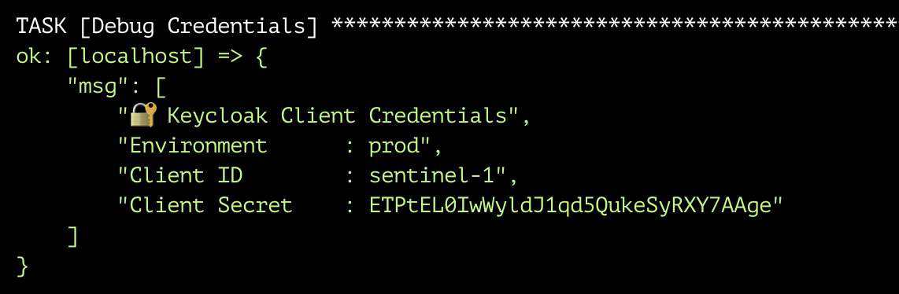
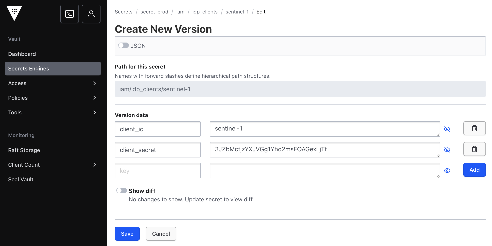
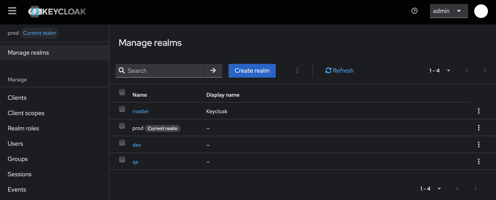
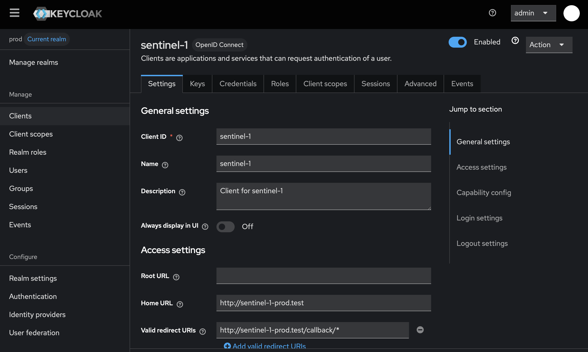
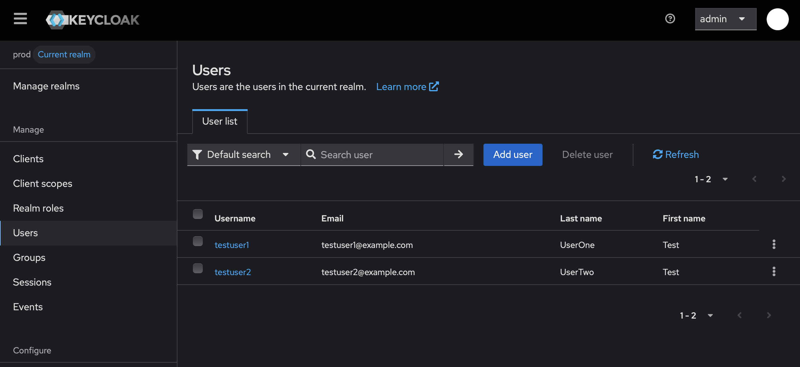
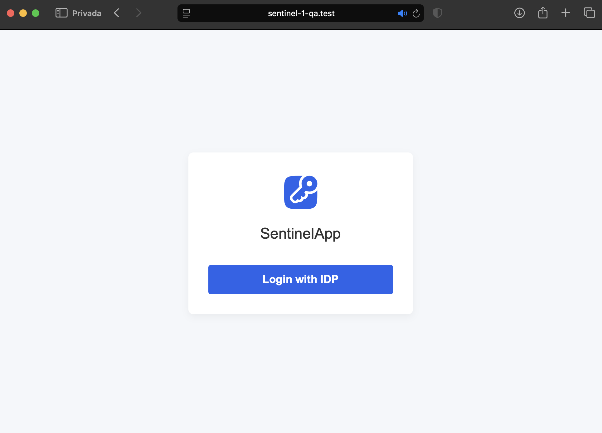
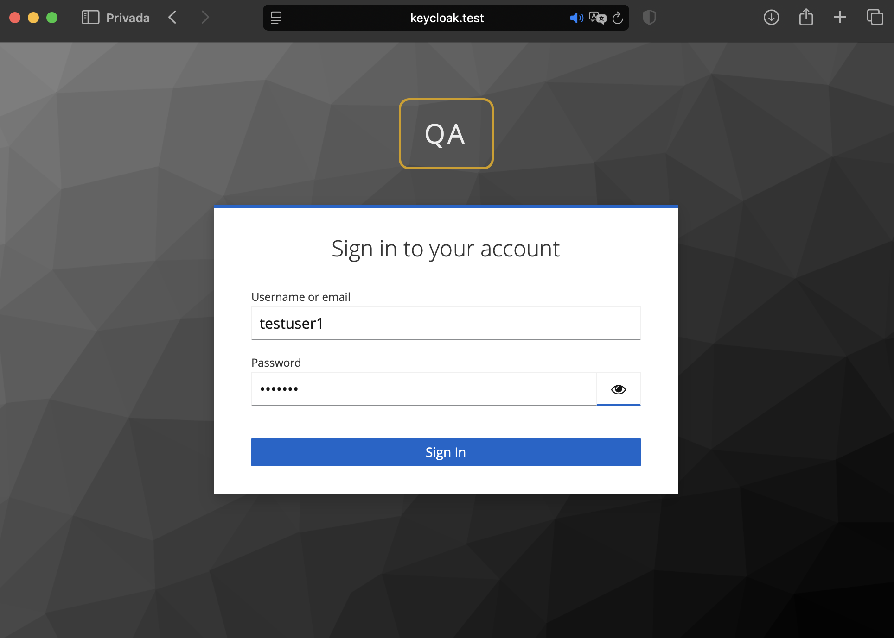
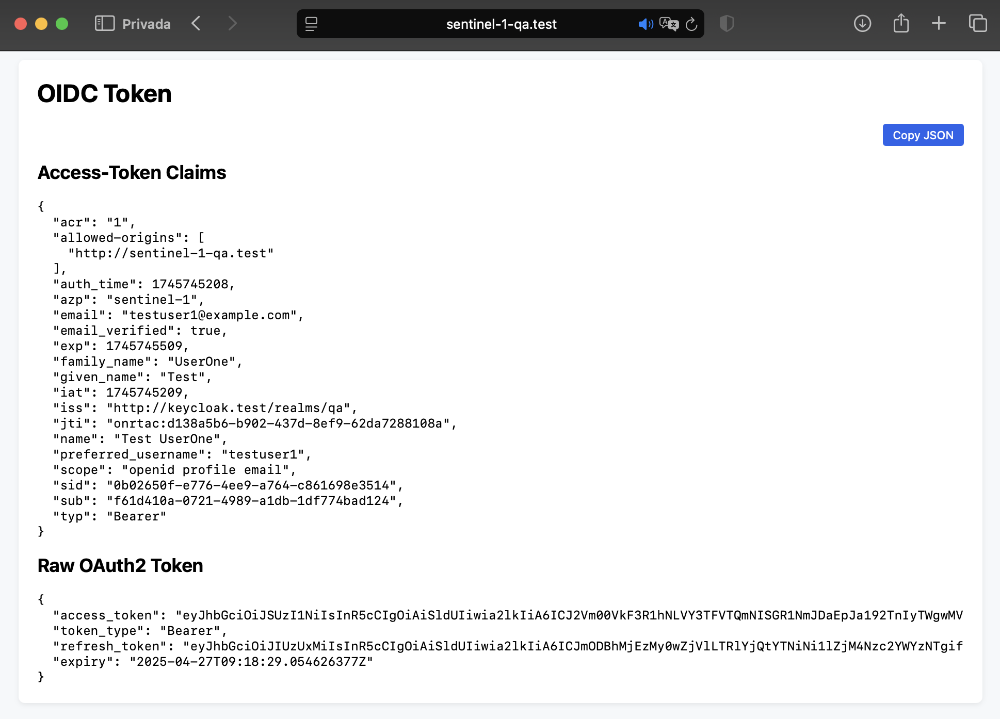

== Deploying Sentinel‑1 API with Vault, ESO, and Keycloak Integration

In this section, we will deploy the *Sentinel‑1* Go-based API into a Kubernetes cluster, showcasing a complete integration of *HashiCorp Vault* for secrets management, *External Secrets Operator (ESO)* for Kubernetes-native secret synchronization, and *Keycloak* as the centralized Identity Provider (IdP).

The Sentinel‑1 API source code is publicly available at: https://github.com/myworkshops/sentinel-1.git[Sentinel-1 GitHub Repository, window=_blank].

Each instance of the application will authenticate against a dedicated Keycloak client configured within separate realms corresponding to each environment (`dev`, `qa`, and `prod`).  
The associated credentials (`client_id` and `client_secret`) for each client will be securely stored in environment-specific Vault KV secrets engines (`secret-dev`, `secret-qa`, `secret-prod`).

To enable secure, dynamic injection of secrets into Kubernetes workloads, a `SecretStore` and an `ExternalSecret` will be provisioned per namespace.  
ESO will dynamically synchronize credentials from Vault, projecting them into Kubernetes as native `Secret` objects with automatic updates on credential changes.

Once credentials are synchronized, the Sentinel‑1 API will be deployed into each namespace.  
The application is designed to load its configuration dynamically from the mounted secrets and supports hot-reloading, ensuring seamless propagation of secret rotations without requiring manual restarts.

This deployment exemplifies a full-stack, cloud-native architecture aligned with *zero-trust security principles*, demonstrating best practices in secure workload configuration and multi-environment identity federation.

=== Automating Keycloak Realm, Client, and User Provisioning

In this step, we automate the creation of Keycloak realms, clients, and users using Ansible.  
This configuration is executed separately for each environment (`dev`, `qa`, `prod`) to enforce proper segregation and security boundaries.

We use the following Ansible playbooks:

- `realm.yml`: creates the Keycloak realm (e.g., `dev`, `qa`, `prod`)
- `client.yml`: defines a Keycloak client inside that realm
- `user.yml`: creates a set of users to authenticate into the application

These playbooks use a shared `values.yml` file to define reusable parameters such as client names, URIs, and user lists.

[NOTE]
====
Before running the playbooks, ensure that Ansible is installed on your machine.  
You can install Ansible using `pip` or your system’s package manager.

[source,bash]
----
# For Ubuntu/Debian
sudo apt update
sudo apt install python3-pip -y
pip3 install --user ansible

# For macOS with Homebrew
brew install ansible
----

Verify your installation with:

[source,bash]
----
ansible --version
----
For more, visit: https://docs.ansible.com/ansible/latest/installation_guide/intro_installation.html
====

==== Execute per Environment

To automate the creation of realms, clients, and users in Keycloak:

Set the environment variable `ENV` to the desired environment (`dev`, `qa`, or `prod`):

[source,bash]
----
export ENV=prod
----

Run the playbooks using the `ENV` variable to target the corresponding environment:

[source,bash]
----
ansible-playbook realm.yml \
  -e @values.yml \
  -e env_work=$ENV \
  -e auth_username=admin \
  -e auth_password=admin123

ansible-playbook client.yml \
  -e @values.yml \
  -e env_work=$ENV \
  -e auth_username=admin \
  -e auth_password=admin123

ansible-playbook user.yml \
  -e @values.yml \
  -e env_work=$ENV \
  -e auth_username=admin \
  -e auth_password=admin123
----

Repeat for each environment by setting `ENV` accordingly.

[NOTE]
====
Ensure the Keycloak instance is reachable at `http://keycloak.test` before executing these playbooks.  
The realms, clients, and users will be created under their respective environments.
====

[IMPORTANT]
====
After running the playbooks, locate the generated `client_id` and `client_secret` in the Ansible logs.  
Store them manually in Vault under the corresponding path for each environment:

- `secret-dev/iam/idp_clients/sentinel-1`
- `secret-qa/iam/idp_clients/sentinel-1`
- `secret-prod/iam/idp_clients/sentinel-1`

Each secret must contain the keys:
- `client_id`
- `client_secret`

This ensures that credentials are securely stored for later retrieval via External Secrets Operator.
====

.Ansible output showing client credentials

.Credentials stored in Vault

=== Keycloak Configuration Validation (Optional)

After running the playbooks, you can visually confirm that the realms, clients, and users were created correctly in the Keycloak Admin UI.

==== View Realms List

Log in to the Keycloak Admin Console (`http://keycloak.test/admin`) using the admin credentials.  
You should see the list of realms including: `dev`, `qa`, and `prod`.

==== View Client Configuration

Within any realm (e.g. `prod`), go to `Clients → sentinel-1`.  
This shows the client details including client ID, secret, redirect URIs, and access settings.

==== View Created Users

Navigate to `Users` within the selected realm to confirm that the test users were successfully provisioned.

These visual checks serve as a quick validation that the automation executed correctly and that your identity layer is correctly configured per environment.

=== Deploying Sentinel‑1 API with Vault, ESO, and Keycloak Integration

In this section, we will deploy the Sentinel‑1 API into the `dev`, `qa`, and `prod` namespaces.  
Secrets (`client_id` and `client_secret`) will be synchronized from Vault into Kubernetes using the External Secrets Operator (ESO).

We will automate everything using a `for` loop to avoid repetition.

==== Step 1: Deploy SecretStore and ExternalSecret for each environment

Use the following script to create the SecretStore and ExternalSecret dynamically for each namespace (`dev`, `qa`, `prod`).

[source,bash]
----
for ENV in dev qa prod; do
  echo "Deploying SecretStore and ExternalSecret in $ENV..."

  helm upgrade --install vault-$ENV \
    helm/external-secrets/secretStore/ \
    --namespace $ENV \
    --set vault.vaultPath=secret-$ENV \
    --set vault.server=http://vault.vault.svc:8200 \
    --set vault.auth.kubernetes.mountPath=kubernetes \
    --set vault.auth.kubernetes.role=$ENV \
    --set vault.auth.kubernetes.serviceAccountName=vault-sa

  helm upgrade --install sentinel-1-secret-$ENV \
    helm/external-secrets/externalSecret/ \
    --namespace $ENV \
    --set name=keycloak-client-secret \
    --set secretStore.name=vault-$ENV-store \
    --set secretStore.kind=SecretStore \
    --set target.creationPolicy=Owner \
    --set data[0].secretKey=client_id \
    --set data[0].remoteRef.key=iam/idp_clients/sentinel-1 \
    --set data[0].remoteRef.property=client_id \
    --set data[1].secretKey=client_secret \
    --set data[1].remoteRef.key=iam/idp_clients/sentinel-1 \
    --set data[1].remoteRef.property=client_secret
done
----

This loop will:

- Create a `SecretStore` configured for the correct Vault KV engine per environment.
- Create an `ExternalSecret` to sync the `client_id` and `client_secret` for the Sentinel‑1 API.

==== Step 2: Deploy the Sentinel‑1 API Across Environments

Once the secrets are synchronized into each namespace, we proceed to deploy the *Sentinel‑1* API into the `dev`, `qa`, and `prod` environments.

To automate the deployment process and avoid repetitive manual steps, use the following script:

[source,bash]
----
# Loop through each environment and deploy the Sentinel‑1 API and its corresponding Ingress
for ENV in dev qa prod; do
  echo -e "\n Deploying Sentinel‑1 API in $ENV... \n"

  # Deploy the API using Helm
  helm upgrade --install sentinel-1 helm/sentinel-1/ \
    --namespace $ENV \
    --set api.name=sentinel-1-$ENV \
    --set api.image.name=wmoinar/sentinel-1-$ENV \
    --set api.image.tag=1.0.0 \
    --set api.redirect_url=http://sentinel-1-$ENV.test/callback \
    --set keycloak.issuer_url=http://keycloak.test/realms/$ENV \
    --set keycloak.internal_url=http://keycloak.iam.svc.cluster.local/realms/$ENV

  # Deploy the Ingress for external access
  helm upgrade --install sentinel-1-$ENV-ingress helm/traefik/ingress/ \
    --namespace $ENV \
    --set annotations.ingressClass=traefik \
    --set spec.ingressClassName=traefik \
    --set spec.rules.host=sentinel-1-$ENV.test \
    --set spec.rules.paths[0].path="/" \
    --set spec.rules.paths[0].pathType=Prefix \
    --set spec.rules.paths[0].backend.service.name=sentinel-1-$ENV \
    --set spec.rules.paths[0].backend.service.port=80 \
    --set tls.enabled=false
done
----

This loop automates:

- Deployment of the Sentinel‑1 API containers for each environment.
- Creation of the corresponding Ingress resources to expose the APIs externally.

==== Step 3: Configure Local Access

To access the APIs using their respective domain names, add the following entries to your `/etc/hosts` file:

[source,bash]
----
echo "127.0.0.1 sentinel-1-dev.test" | sudo tee -a /etc/hosts
echo "127.0.0.1 sentinel-1-qa.test" | sudo tee -a /etc/hosts
echo "127.0.0.1 sentinel-1-prod.test" | sudo tee -a /etc/hosts
----

This ensures that your local machine resolves the custom hostnames to your cluster’s Ingress controller.

=== Verifying the End-to-End Platform Setup

This section provides a structured validation process to ensure that all deployed components—Vault, External Secrets Operator (ESO), Keycloak, and the Sentinel‑1 application—are fully operational and integrated across all target environments (`dev`, `qa`, and `prod`).

==== Infrastructure and Synchronization Validation

First, validate the state of Kubernetes workloads and resources.

Check that the Sentinel‑1 API pods are running:

[source,bash]
----
oc get pods -A | grep sentinel-1
----

Expected output:

[source,console]
----
dev    sentinel-1-dev-7d8df797c8-66htp     1/1   Running   0   11h
prod   sentinel-1-prod-74d897864-hfzqz     1/1   Running   0   11h
qa     sentinel-1-qa-59d6d55795-z8pps      1/1   Running   0   11h
----

Validate that the `SecretStore` resources have been successfully created and are in a `Ready` state:

[source,bash]
----
oc get SecretStore -A
----

Expected output:

[source,console]
----
NAMESPACE   NAME               AGE   STATUS   CAPABILITIES   READY
dev         vault-dev-store    44h   Valid    ReadWrite      True
dev         vault-store        43h   Valid    ReadWrite      True
prod        vault-prod-store   43h   Valid    ReadWrite      True
qa          vault-qa-store     43h   Valid    ReadWrite      True
----

Verify that all `ExternalSecret` resources are actively synchronized with Vault:

[source,bash]
----
oc get ExternalSecret -A
----

Expected output:

[source,console]
----
NAMESPACE   NAME                     STORETYPE     STORE              REFRESH INTERVAL   STATUS         READY
dev         dev-credential           SecretStore   vault-store        1h                 SecretSynced   True
dev         sentinel-1-secret-dev    SecretStore   vault-dev-store    1h                 SecretSynced   True
prod        sentinel-1-secret-prod   SecretStore   vault-prod-store   2s                 SecretSynced   True
qa          sentinel-1-secret-qa     SecretStore   vault-qa-store     1h                 SecretSynced   True
----

Finally, confirm that Kubernetes secrets have been materialized correctly:

[source,bash]
----
oc get secret -A | grep synced-sentinel-1-secret
----

Expected output:

[source,console]
----
dev    synced-sentinel-1-secret-dev     Opaque   2   12h
prod   synced-sentinel-1-secret-prod    Opaque   2   12h
qa     synced-sentinel-1-secret-qa      Opaque   2   12h
----

==== Application Functionality Validation

Next, validate end-to-end application login and token acquisition.

. Open a browser and navigate to the deployed application for the `qa` environment: `http://sentinel-1-qa.test`
+
You should see the **Login with Keycloak** button.

. Click the login button to initiate the OIDC authentication flow via Keycloak.  
You should be redirected to the Keycloak login page associated with the `qa` realm.

. Authenticate with valid user credentials (`testuser1` or equivalent).

. Finally, the Sentinel‑1 API will display the retrieved ID token, including decoded claims from the Access Token:

==== Summary

Successful validation across these steps confirms that:

- Vault, Kubernetes, and ESO are correctly integrated and secrets are dynamically provisioned.
- Keycloak is acting as the identity provider with environment-specific realms.
- The Sentinel‑1 API is capable of real-time secret consumption and OIDC-based user authentication.

[IMPORTANT]
====
If any validation step fails, investigate the corresponding subsystem (Vault policy, ESO configuration, Keycloak client mapping, or Kubernetes resource deployment) before proceeding.
====